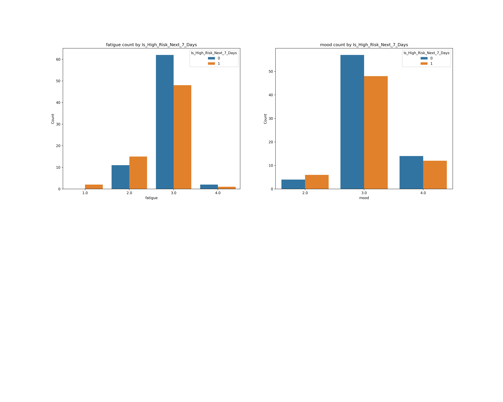
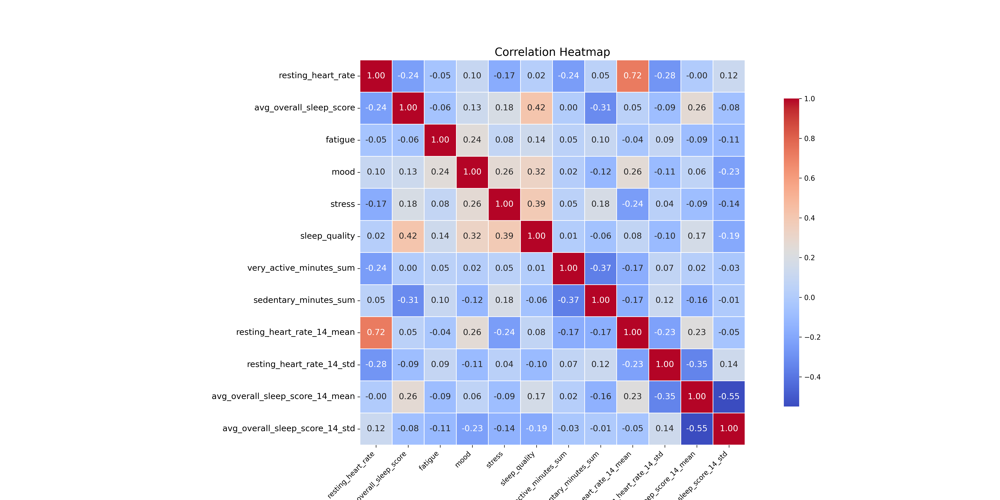

# DSAI3301---Physiological-Signals-Mental-Health-Assessment

# Project Documentation: Student Risk Prediction MVP

Date: June 14, 2024

## 1. Project Context and Goal
### 1.1 Objective
To develop a Minimum Viable Product (MVP) of a predictive model capable of proactively identifying university students at risk of entering a negative wellness state. This model is intended as a proof-of-concept for a data science course project.

### 1.2 Problem Statement

University counseling services often operate in a reactive mode, addressing student issues only after they are self-reported or have escalated to a crisis. The core problem is an information lag between scheduled appointments, preventing timely and proactive intervention. This project aims to bridge that gap using passively collected data.

### 1.3  Methodology
The project is being executed in strict accordance with the Team Data Science Process (TDSP) framework, ensuring a structured and repeatable workflow from business understanding through to deployment.

### 1.4 Data Source
The project utilizes the PMDATA dataset, a publicly available collection of multi-modal data. For this MVP, we are using a combination of:

Fitbit Data: Objective physiological data (e.g., heart rate, sleep).

PMSys Data: Subjective, self-reported wellness data (e.g., mood, stress).

### 1.5 Development Strategy
To ensure a robust and debuggable pipeline, all development, data wrangling, and feature engineering are being performed on a single, representative participant (p07) before any attempt to scale the solution to the full 16-participant cohort.

### 1.6 Project Constraints & Assumptions
This section outlines the key constraints and foundational assumptions under which this Minimum Viable Product (MVP) was developed. These boundaries are critical for interpreting the project's results and understanding its intended scope.

#### 1.6.1 Constraints
Academic Scope: This project is developed as a Minimum Viable Product (MVP) within the time constraints of the DSAI3301 course. The primary objective is to demonstrate a viable end-to-end data science workflow, not to produce a production-ready, clinically validated tool.

"Frozen" Business Rules: The definitions for "High-Risk State" and the "Composite Risk Score" were treated as fixed, unchangeable business requirements for the purpose of this project. The engineering and modeling phases were focused exclusively on implementing these pre-defined rules.

#### 1.6.2 Assumptions
Validity of Business Rules: The project operates on the core assumption that the provided rule-based definition of a "High-Risk State" serves as a meaningful and useful proxy for a student's negative wellness state. The validity of this metric itself has not been tested or confirmed with clinical stakeholders. The model's success is measured by its ability to predict this proxy, not an externally validated clinical outcome.

## 2. Phase 1: Business Understanding (Stage Complete)
This phase is considered complete and "frozen" for the scope of the MVP. The following definitions and business rules were established as the unchangeable foundation for all subsequent technical work.

### 2.1. Target Variable Definition
Name: Is_High_Risk_Next_7_Days

Type: Binary (1 for True, 0 for False)

Description: A flag that predicts if a "High-Risk State" will occur at any point within the subsequent 7-day window from a given day.

### 2.2. Operationalized Definition of "High-Risk State"
A student is classified as being in a "High-Risk State" on any day where their Composite_Risk_Score for that day is greater than or equal to 3.

### 2.3 Composite Risk Score Calculation
The Composite_Risk_Score is an unweighted sum of two daily sub-scores:

#### A. Subjective Distress Score (Range: 0-4 points)
Source: Daily wellness logs (wellness.csv).

Logic: Points are accrued based on self-reported scores on a 1-5 scale, where a score of 1 or 2 indicates a negative state.

+1 point if fatigue is 1 or 2.

+1 point if mood is 1 or 2.

+1 point if stress is 1 or 2.

+1 point if sleep_quality is 1 or 2.

#### B. Physiological Deviation Score (Range: 0-2 points)
Source: Daily Fitbit data (resting_heart_rate.json, sleep_score.csv).

Logic: Points are accrued if a physiological metric deviates significantly from the student's personal, rolling baseline.

+1 point if resting_heart_rate is more than 1.0 standard deviation above its personal baseline.

+1 point if avg_overall_sleep_score is more than 1.0 standard deviation below its personal baseline.

### 2.4. Baseline Definition
For the MVP, a 14-day rolling window was selected to calculate the personal baseline (mean and standard deviation) for physiological metrics. This window provides a balance between responsiveness to recent changes and statistical stability, given the limited dataset size.

## 3. Phase 2: Data Acquisition & Understanding (Stage Complete)

### 3.1. MVP Data File Strategy
To minimize complexity, the MVP focuses on a minimal set of five essential files from the PMDATA dataset for participant p07:

resting_heart_rate.json

sleep_score.csv

wellness.csv

very_active_minutes.json

sedentary_minutes.json

### 3.2. Final MVP Feature Set
The final set of input features selected for the model comprises 8 core metrics:

resting_heart_rate

avg_overall_sleep_score

fatigue

mood

stress

sleep_quality

very_active_minutes_sum

sedentary_minutes_sum

## Phase 4: Data Wrangling & Feature Engineering 
This section documents the technical data processing pipeline built for participant p07.

### 4.1 Step 1: Data Parsing & Loading
Individual Python functions were created to load each of the five source files. Each function is responsible for:

Parsing the specific file format (JSON or CSV).

Converting the date/time column to a standardized datetime object and setting it as the DataFrame index.

Selecting only the columns required for the MVP feature set.

### 4.2 Step 2: Merging

The five processed DataFrames were merged into a single master DataFrame (df_merged) using an outer join on the standardized datetime index. This method ensures all records are kept, creating a complete timeline.

### 4.3. Step 3: Missing Data Imputation
The merged DataFrame contained expected NaN values due to the nature of the data sources. A two-step imputation strategy was applied to create a dense, complete dataset:

Forward-fill (ffill()): Propagates the last valid observation forward.

Back-fill (bfill()): Fills any remaining NaNs (primarily at the start of the dataset) with the next valid observation

### 4.4. Step 4: Baseline Calculation
A function was implemented to calculate the rolling 14-day baselines for resting_heart_rate and avg_overall_sleep_score. To handle the initial 13-day period where a full rolling window is not available, the calculated NaN values were back-filled, a pragmatic decision to maximize data retention for the MVP.

## Phase 5: Target Variable Engineering
In any supervised machine learning project, the model learns the relationship between a set of input features (X) and a target variable (Y). Our current DataFrame contains the features (X). The task now is to create the target (Y).

### 5.1 Logical Imperative: The Need for Proactivity

The core business problem is to move from a reactive to a proactive model of student care. A model that simply classifies a student's current risk state (Is_High_Risk_Today) has limited utility; by the time the data is processed and an alert is sent, the opportunity for early intervention may have passed. True proactivity requires forecasting. We need to give the counselor actionable lead time.

### 5.2 Research and Domain Basis

The concept of a prediction horizon is well-established in clinical informatics and analogous fields like predictive maintenance. Research in early warning systems consistently demonstrates that their value is directly proportional to the lead time they provide. By defining our target as the likelihood of a high-risk state occurring within a future window (in our case, 7 days), we are framing the problem correctly. We are asking the model: "Based on the patterns observed today, what is the probability of a negative event sequence initiating sometime in the coming week?" This provides a clear, actionable window for a counselor to intervene before a crisis fully manifests.

### 5.3 Step-by-Step Technical Execution Plan
The engineering of our final target variable, Is_High_Risk_Next_7_Days, will be performed in a sequence of three logical, auditable steps.

#### 5.3.1: Calculate the Composite_Risk_Score
Action: A new column, Composite_Risk_Score, will be created by summing the Subjective_Distress_Score and the Physiological_Deviation_Score.

Rationale (TDSP - Feature Engineering): This step finalizes the daily risk metric by aggregating the multi-modal signals as defined by the business rules. It transforms multiple, disparate indicators into a single, ordinal score that represents the total evidence of risk for a given day. This is a form of dimensionality reduction, simplifying the concept of "daily risk" into a single, computable value.

#### 5.3.2: Identify the Daily High_Risk_State
Action: A new binary column, High_Risk_State, will be created. It will be assigned a value of 1 if the Composite_Risk_Score for that day is 3 or greater, and 0 otherwise.

Rationale (TDSP - Data Understanding): This step operationalizes the risk score into a concrete, binary event. It answers the simple question: "On this specific day, did the student meet the criteria for a high-risk state?" This column provides a clear, daily ground truth and serves as the essential building block for our final predictive target.

#### 5.3.3: Engineer the Predictive Target (Is_High_Risk_Next_7_Days)
Action: This is the crucial time-series transformation. For each day d in our dataset, we will perform a "look-ahead" operation. We will examine the High_Risk_State column for the subsequent 7 days (i.e., the window from d+1 to d+7). If the maximum value within that future window is 1 (meaning at least one high-risk day occurred), the target variable Is_High_Risk_Next_7_Days for the original day d will be set to 1. Otherwise, it will be set to 0.

Rationale (TDSP - Modeling Preparation): This action directly encodes the business requirement for a proactive, 7-day prediction horizon into the dataset itself. We are effectively shifting the "answer" from the future back to the present. This reframes the machine learning task from a simple daily classification to a forward-looking prediction. The model will be trained to find the subtle patterns in the features on a given day that are predictive of a problem emerging over the next week.

Technical Note on Data Truncation: This look-ahead operation cannot be performed for the final 7 days of the dataset, as a full 7-day future window does not exist for them. These rows will have an invalid target and must be truncated from the dataset before it is passed to the model. This is a standard and required procedure in time-series forecasting to prevent data leakage and ensure the model only learns from valid, complete examples.

Upon completion of this plan, we will possess the final artifact of the data preparation phase: a DataFrame containing the full set of features (X) and a corresponding predictive target vector (Y).

## 6. Exploratory Data Analysis
A comprehensive EDA was performed on the fully engineered, pre-modeling dataset.

Key Finding 1: Subjective Feelings are the Strongest Predictors. Bivariate analysis showed a clear and powerful relationship between the subjective wellness columns and the target variable. Days with lower reported mood or higher fatigue were disproportionately followed by a high-risk week. This is the most significant finding from the EDA.

Key Finding 2: Raw Physiological Signals are Weak Predictors. In contrast, the raw values for resting_heart_rate and activity minutes showed almost no discernible difference between the two target classes. Their predictive power, if any, will likely come from their deviation from the baseline or in complex interactions with other features.

Key Finding 3: The Dataset is Well-Conditioned. The correlation heatmap revealed no strong multicollinearity between independent features. Univariate analysis confirmed that distributions were plausible, with no erroneous outliers requiring removal.

Key Finding 4: The Target Class is Well-Balanced. The final target variable distribution was approximately 0: 81 and 1: 66, which is an excellent, nearly balanced ratio. This simplifies the modeling phase, as complex techniques to handle class imbalance are likely unnecessary.

The data preparation and analysis phase is complete. We have successfully transformed raw data into a high-quality, feature-rich dataset. Our EDA has provided strong, data-driven hypotheses about which features will be most predictive.

The project is now officially moving to the Modeling stage of the TDSP. The immediate next steps will be:

Time-Series Split: Partition the 141-row dataset into training and testing sets using a time-ordered split.

Baseline Model: Train a simple, interpretable model (e.g., Logistic Regression) to establish a baseline performance metric.

Advanced Model: Train a more complex, non-linear model (e.g., Random Forest) to capture potential feature interactions and attempt to outperform the baseline.